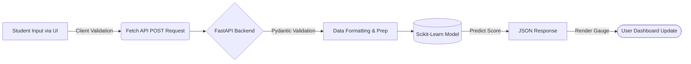

<div align="center">
  
  
  # 🧠 MindMetric

  **Student Wellbeing Prediction from Digital Habits and Daily Routines**

  [](https://mindmetric-student-wellbeing-predictor-1.onrender.com/)
  [](https://www.python.org/)
  [](https://fastapi.tiangolo.com/)
  [](https://scikit-learn.org/)
</div>

---

## 📖 Overview

**MindMetric** is a full-stack, machine learning-powered application designed to estimate student mental wellbeing. By analyzing digital habits (like social media usage and daily unlocks), study time, sleep patterns, physical activity, and self-reported stress, the model provides an insightful wellbeing score.

> **Disclaimer:** *This project is for educational reflection and portfolio purposes only. The result is a model estimate based on a dataset and is NOT a medical diagnosis or professional psychological advice.*

---

## ✨ Key Features

- **📊 Predictive Analytics:** Utilizes a trained `scikit-learn` Machine Learning model to calculate mental wellbeing scores.
- **⚡ High-Performance API:** Backend built with `FastAPI`, providing fast and robust endpoints with `Pydantic` data validation.
- **📱 Responsive UI/UX:** A clean, guided, and mobile-friendly web interface for students to input their daily metrics seamlessly.
- **🌐 Deployed on Render:** The application is live and accessible globally.
- **🔒 Secure & Validated:** Client-side form validation coupled with robust server-side data enforcement.

---

## 🛠️ Technology Stack

| Component | Technology | Description |
| :--- | :--- | :--- |
| **Frontend** | HTML5, CSS3, JavaScript | Responsive user interface, form validation, and dynamic UI updates (gauges/charts). |
| **Backend API** | FastAPI, Python | High-performance asynchronous framework to serve predictions. |
| **Machine Learning** | Scikit-Learn, Pandas | The core predictive engine utilizing a custom-trained model (`.pkl`). |
| **Deployment** | Render | Cloud platform hosting the live service. |

---

## ⚙️ How It Works



---

## 🚀 Getting Started

Follow these instructions to get a copy of the project up and running on your local machine for development and testing purposes.

### 1. Prerequisites

Ensure you have **Python 3.10+** installed on your machine.

### 2. Clone the Repository

```bash
git clone https://github.com/YOUR-USERNAME/YOUR-REPOSITORY.git
cd ml_project_mental_health
```

### 3. Create a Virtual Environment

**Windows:**
```powershell
python -m venv .venv
.\.venv\Scripts\activate
```

**macOS / Linux:**
```bash
python3 -m venv .venv
source .venv/bin/activate
```

### 4. Install Dependencies

```bash
pip install -r requirements.txt
```

### 5. Run the Application

Start the FastAPI server utilizing `uvicorn`:

```bash
uvicorn main:app --reload
```

- The API will be available at `http://127.0.0.1:8000`.
- Interactive API documentation (Swagger UI) is available at `http://127.0.0.1:8000/docs`.
- Open `index.html` in your web browser to interact with the frontend application locally.

---

## 📡 API Reference

### Health Check

Check if the API is running correctly.

```http
GET /
```

**Response:**
```json
["Welcome"]
```

### Predict Wellbeing Score

Submit student data to receive a mental wellbeing prediction.

```http
POST /predict
```

**Payload Example:**
```json
{
  "age": 21,
  "gender": "Male",
  "country": "India",
  "academic_level": "Undergraduate",
  "most_used_platform": "Instagram",
  "purpose_of_use": "Entertainment",
  "avg_daily_usage_hours": 4.5,
  "daily_unlocks": 60,
  "study_hours": 3.0,
  "physical_activity_hours": 1.0,
  "sleep_hours_per_night": 7.0,
  "stress_level": "Medium"
}
```

**Response Example:**
```json
{
  "predicted_mental_health_score": 6.02
}
```

---

## 🌍 Live Deployment

The application is deployed and can be tested live here:
🔗 **[MindMetric Live Server](https://mindmetric-student-wellbeing-predictor-1.onrender.com/)**

---

## 📁 Project Structure

```text
📁 ml_project_mental_health/
│
├── 📄 index.html                      # Main web application interface
├── 📄 Style.css                       # Application styling
├── 📄 Script.js                       # Frontend logic and API integration
├── 📄 main.py                         # FastAPI backend service
├── 📄 mental_health_model.pkl         # Trained ML Model weights
├── 📄 mental_health.ipynb             # Exploratory Data Analysis & Model Training
├── 📄 Student Social Media And Mental Health Impact.csv # Source Dataset
├── 📄 requirements.txt                # Python package dependencies
└── 📁 assets/                         # Project images and assets
```

---

## ⚖️ License & Responsible Use

This project was developed for educational and portfolio purposes. The predictions should be treated as hypothetical data points based on limited datasets. If you or someone you know is experiencing mental health difficulties, please reach out to a qualified professional or a trusted support line.
