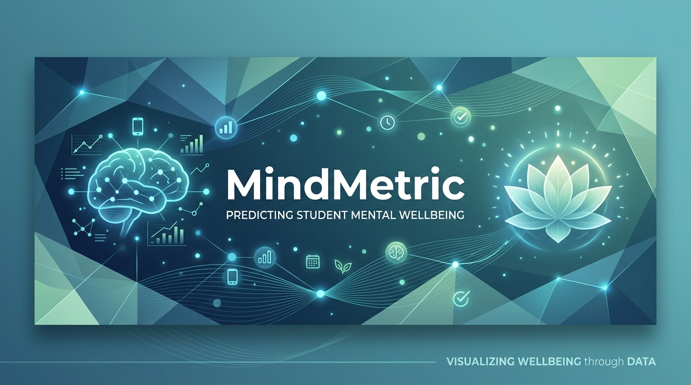

<div align="center">
  
  
  # 🧠 MindMetric

  **Student Wellbeing Prediction from Digital Habits and Daily Routines**

  [](https://mindmetric-student-wellbeing-predictor-1.onrender.com/)
  [](https://mindmetric-student-wellbeing-predictor.onrender.com/docs#/default/predict_predict_post)
  [](https://www.python.org/)
  [](https://fastapi.tiangolo.com/)
  [](https://scikit-learn.org/)
</div>

---

## 📖 Overview

**MindMetric** is a full-stack, machine learning-powered application designed to estimate student mental wellbeing. By analyzing digital habits (like social media usage and daily unlocks), study time, sleep patterns, physical activity, and self-reported stress, the model provides an insightful wellbeing score.

> **Disclaimer:** *This project is for educational reflection and portfolio purposes only. The result is a model estimate based on a dataset and is NOT a medical diagnosis or professional psychological advice.*

---

## 🏗️ How I Built This Project

The development of MindMetric was a complete end-to-end journey bridging Data Science and Full-Stack Engineering. Here is a breakdown of the process:

1. **Data Exploration & Machine Learning (Jupyter Notebook)**
   - **Dataset:** I started with the [Student Social Media And Mental Health Impact](https://www.kaggle.com/datasets/shivasingh4945/student-social-media-and-mental-health-impact) dataset from Kaggle, which contains records of student digital habits.
   - **EDA & Processing:** Using `pandas`, I cleaned the data and grouped minority categories (e.g., grouping less frequent countries into "Other") to improve model generalization.
   - **Model Training:** I trained a machine learning model using `scikit-learn` to predict mental health scores based on features like screen time, study hours, and stress levels.
   - **Export:** The final trained model was serialized and saved as `mental_health_model.pkl` using `joblib`.

2. **Backend API Development (FastAPI)**
   - **Framework:** I chose `FastAPI` for its high performance and built-in asynchronous support.
   - **Data Validation:** I implemented strict data validation using `Pydantic` (`StudentData` class) to ensure the API only accepts clean, formatted data (e.g., age must be between 10 and 100).
   - **Integration:** The API loads the `.pkl` model on startup and uses it to serve predictions via the `POST /predict` endpoint.
   - **CORS:** Configured Cross-Origin Resource Sharing (CORS) so the frontend could securely communicate with the backend.

3. **Frontend Development (Vanilla JS, HTML, CSS)**
   - **Interface:** I built a responsive, interactive web interface using standard HTML5 and CSS3.
   - **Logic:** Wrote custom JavaScript (`Script.js`) to capture user inputs, perform client-side validation, and send a `fetch` request to the backend API.
   - **Visualization:** Integrated dynamic UI updates (like the visual gauge) to interpret and display the model's predicted wellbeing score clearly to the user.

4. **Deployment (Render)**
   - **Hosting:** Both the frontend application and the backend API are deployed live on Render, making the machine learning model accessible from anywhere in the world.

---

## ✨ Key Features

- **📊 Predictive Analytics:** Utilizes a trained `scikit-learn` Machine Learning model.
- **⚡ High-Performance API:** Backend built with `FastAPI` with strict `Pydantic` data validation.
- **📱 Responsive UI/UX:** Clean, guided, and mobile-friendly web interface.
- **🌐 Deployed on Render:** Live and accessible globally.

---

## 🛠️ Technology Stack

| Component | Technology | Description |
| :--- | :--- | :--- |
| **Frontend** | HTML5, CSS3, JavaScript | Responsive user interface and dynamic UI updates. |
| **Backend API** | FastAPI, Python | High-performance asynchronous framework to serve predictions. |
| **Machine Learning** | Scikit-Learn, Pandas | Core predictive engine utilizing a custom-trained model (`.pkl`). |
| **Deployment** | Render | Cloud platform hosting the live service. |

---

## ⚙️ Architecture


---

## 🚀 Getting Started Locally

Follow these instructions to get a copy of the project up and running on your local machine.

### 1. Prerequisites

Ensure you have **Python 3.10+** installed on your machine.

### 2. Clone the Repository

```bash
git clone https://github.com/MUDASSARsd/mindmetric-student-wellbeing-predictor.git
cd mindmetric-student-wellbeing-predictor
```

### 3. Create a Virtual Environment

**Windows:**
```powershell
python -m venv .venv
.\.venv\Scripts\activate
```

**macOS / Linux:**
```bash
python3 -m venv .venv
source .venv/bin/activate
```

### 4. Install Dependencies

```bash
pip install -r requirements.txt
```

### 5. Run the Application

Start the FastAPI server utilizing `uvicorn`:

```bash
uvicorn main:app --reload
```

- The API will be available at `http://127.0.0.1:8000`.
- Open `index.html` in your web browser to interact with the frontend application locally.

---

## 📡 API Reference

### Health Check
```http
GET /
```
**Response:** `["Welcome"]`

### Predict Wellbeing Score
**[View Interactive API Docs (Swagger)](https://mindmetric-student-wellbeing-predictor.onrender.com/docs#/default/predict_predict_post)**

```http
POST /predict
```

**Payload Example:**
```json
{
  "age": 21,
  "gender": "Male",
  "country": "India",
  "academic_level": "Undergraduate",
  "most_used_platform": "Instagram",
  "purpose_of_use": "Entertainment",
  "avg_daily_usage_hours": 4.5,
  "daily_unlocks": 60,
  "study_hours": 3.0,
  "physical_activity_hours": 1.0,
  "sleep_hours_per_night": 7.0,
  "stress_level": "Medium"
}
```

---

## 🌍 Links

- **Live Application:** [MindMetric Live Server](https://mindmetric-student-wellbeing-predictor-1.onrender.com/)
- **API Documentation:** [Swagger UI Docs](https://mindmetric-student-wellbeing-predictor.onrender.com/docs#/default/predict_predict_post)

---

## ⚖️ License & Responsible Use

This project was developed for educational and portfolio purposes. The predictions should be treated as hypothetical data points based on limited datasets. If you or someone you know is experiencing mental health difficulties, please reach out to a qualified professional or a trusted support line.
